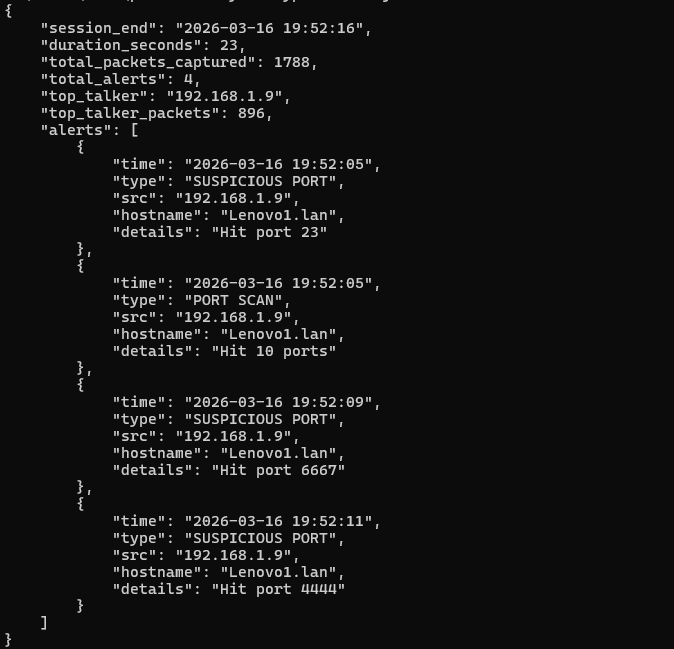

# Network Packet Analyzer

A Python-based network security tool that captures live traffic and detects suspicious activity in real time.

## Features
- Live packet capture using Scapy
- TCP/UDP protocol detection
- Port scan detection
- High traffic volume alerting
- Suspicious port flagging 
- Reverse DNS resolution (IP to hostname)
- JSON alert logging with timestamps and hostnames
- Session summary report

## Demo
Running the tool and triggering a port scan with Nmap:



Example alert output (`alerts.json`):
```json
{
    "session_end": "2026-03-16 19:35:17",
    "duration_seconds": 58,
    "total_packets_captured": 673,
    "total_alerts": 2,
    "top_talker": "192.168.1.9",
    "top_talker_packets": 344,
    "alerts": [
        {
            "time": "2026-03-16 19:34:48",
            "type": "SUSPICIOUS PORT",
            "src": "192.168.1.9",
            "details": "Hit port 23"
        },
        {
            "time": "2026-03-16 19:34:48",
            "type": "PORT SCAN",
            "src": "192.168.1.9",
            "details": "Hit 10 ports"
        }
    ]
}
```

## How It Works
The tool uses Scapy to capture raw packets off the network interface. Each packet is analyzed for:
- **Port scans** — one IP hitting 10+ unique ports within a session
- **High traffic** — one IP sending 1000+ packets within 60 seconds
- **Suspicious ports** — traffic to known malicious ports (23, 4444, 6667, 1337, 31337)

All alerts are saved to `alerts.json` with timestamps and a session summary on exit.

## Installation
```bash
pip install scapy
```
Also requires [Npcap](https://npcap.com) on Windows.

## Usage
```bash
python sniffer.py
```
Press `CTRL+C` to stop and generate the session report.

## Tech Stack
- Python 3
- Scapy
- JSON

## Detection Logic
| Type | Condition |
|------|-----------|
| Port Scan | Single IP hits 10+ unique ports |
| High Traffic | Single IP sends 1000+ packets in 60s |
| Suspicious Port | Traffic to ports 23, 4444, 6667, 1337, 31337 |